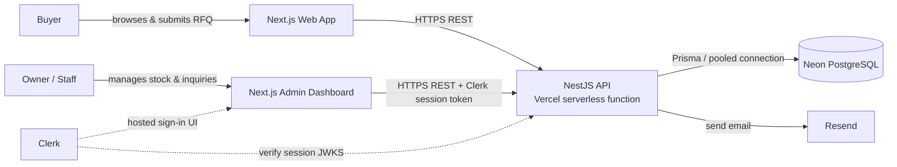

# Green Farm Agrotech — Order & Stock Visibility Portal

**Full Architecture Reference** · MVP · Target ship date: Monday

Stack: **Next.js** (frontend) + **NestJS** (API) + **Neon PostgreSQL** (database) + **Prisma** (ORM) + **Clerk** (auth) + **Resend** (email), all deployed on **Vercel**.

---

## 1. Overview

The system is a monorepo with two deployable apps:

- **`apps/web`** — a Next.js app serving the public product catalog + RFQ form, and the Clerk-protected admin dashboard.
- **`apps/api`** — a NestJS REST API, deployed on Vercel as serverless functions, backed by Neon Postgres via Prisma.

Both apps deploy independently to Vercel from the same repository. The frontend never talks to the database directly — every read or write goes through the NestJS API.

---

## 2. Monorepo Folder Structure

```
green-farm-agrotech/
├── apps/
│   ├── web/                        # Next.js frontend
│   │   ├── app/
│   │   │   ├── (public)/
│   │   │   │   ├── page.tsx                    # Product catalog (home)
│   │   │   │   ├── products/[id]/page.tsx      # Product detail + RFQ form
│   │   │   │   └── inquiry-sent/page.tsx       # Confirmation screen
│   │   │   ├── admin/
│   │   │   │   ├── layout.tsx                  # Wraps admin routes, requires Clerk session
│   │   │   │   ├── page.tsx                    # Dashboard overview
│   │   │   │   ├── products/page.tsx           # Stock management table
│   │   │   │   └── inquiries/page.tsx          # Inquiry list + status updates
│   │   │   ├── sign-in/[[...sign-in]]/page.tsx # Clerk hosted sign-in
│   │   │   ├── layout.tsx                      # Root layout (ClerkProvider)
│   │   │   └── globals.css
│   │   ├── components/
│   │   │   ├── ProductCard.tsx
│   │   │   ├── InquiryForm.tsx
│   │   │   ├── StockTable.tsx
│   │   │   └── InquiryList.tsx
│   │   ├── lib/
│   │   │   ├── api-client.ts        # fetch wrapper — attaches Clerk session token
│   │   │   └── types.ts             # shared frontend types (Product, Inquiry)
│   │   ├── middleware.ts            # Clerk middleware — protects /admin/*
│   │   ├── next.config.js
│   │   ├── package.json
│   │   └── .env.local               # NEXT_PUBLIC_* keys (see §7)
│   │
│   └── api/                         # NestJS backend
│       ├── src/
│       │   ├── main.ts                          # Local dev bootstrap
│       │   ├── app.module.ts
│       │   ├── products/
│       │   │   ├── products.module.ts
│       │   │   ├── products.controller.ts
│       │   │   ├── products.service.ts
│       │   │   └── dto/
│       │   │       ├── create-product.dto.ts
│       │   │       └── update-product.dto.ts
│       │   ├── inquiries/
│       │   │   ├── inquiries.module.ts
│       │   │   ├── inquiries.controller.ts
│       │   │   ├── inquiries.service.ts
│       │   │   └── dto/
│       │   │       ├── create-inquiry.dto.ts
│       │   │       └── update-inquiry.dto.ts
│       │   ├── auth/
│       │   │   ├── clerk-auth.guard.ts          # Verifies Clerk session on admin routes
│       │   │   └── clerk-auth.module.ts
│       │   ├── email/
│       │   │   ├── email.module.ts
│       │   │   └── email.service.ts             # Resend client
│       │   └── prisma/
│       │       ├── prisma.module.ts
│       │       └── prisma.service.ts            # PrismaClient singleton
│       ├── prisma/
│       │   ├── schema.prisma
│       │   ├── migrations/
│       │   └── seed.ts                          # Loads initial product list
│       ├── api/
│       │   └── index.ts             # Vercel serverless entry point (wraps Nest app)
│       ├── vercel.json              # Routes all requests to api/index.ts
│       ├── package.json
│       └── .env                     # DATABASE_URL, CLERK_SECRET_KEY, RESEND_API_KEY
│
├── package.json                     # Workspace root (npm workspaces)
└── README.md
```

Two Vercel projects point at this one repository: one rooted at `apps/web`, one rooted at `apps/api`. Each gets its own URL, environment variables, and deploy pipeline, but both redeploy automatically on push to `main`.

---

## 3. `apps/web` — Next.js Frontend

| Piece | Responsibility |
|---|---|
| `app/(public)/page.tsx` | Fetches `GET /api/products` server-side and renders the live catalog — no login required. |
| `app/(public)/products/[id]/page.tsx` | Product detail + the RFQ form (`InquiryForm`), which posts to `POST /api/inquiries`. |
| `app/admin/*` | Stock management and inquiry tracking. Every route under `admin/` is gated by `middleware.ts`. |
| `middleware.ts` | Uses Clerk's Next.js middleware to redirect unauthenticated visitors from `/admin/*` to `/sign-in`. |
| `app/sign-in/[[...sign-in]]/page.tsx` | Renders Clerk's prebuilt `<SignIn />` component — no custom login form to build. |
| `lib/api-client.ts` | Central fetch wrapper. For admin calls, it reads the Clerk session token (via `auth()` on the server or `useAuth()` on the client) and attaches it as `Authorization: Bearer <token>` on every request to the NestJS API. |

The frontend holds **no persistent state of its own** — it's a rendering and forms layer over the API.

---

## 4. `apps/api` — NestJS Backend

| Piece | Responsibility |
|---|---|
| `products/` | CRUD for products and stock quantities. Public `GET` endpoints are unauthenticated; `POST`/`PATCH`/`DELETE` under `/admin` require a valid Clerk session. |
| `inquiries/` | Accepts buyer RFQ submissions (public `POST`), and exposes admin `GET`/`PATCH` for managing status (`NEW → CONTACTED → QUOTED → CLOSED`). Triggers `EmailService` on creation. |
| `auth/clerk-auth.guard.ts` | A NestJS `CanActivate` guard applied to all `/admin/*` routes. It reads the bearer token, verifies it against Clerk's JWKS endpoint using `@clerk/backend`, and rejects the request if the session is invalid or missing. |
| `email/email.service.ts` | Thin wrapper around the Resend SDK. Called by `InquiriesService` after a successful insert — sends the owner a notification and the buyer a confirmation. Stateless; no retry queue in v1. |
| `prisma/prisma.service.ts` | Instantiates a single `PrismaClient`, reused across requests to avoid exhausting Neon's connection limit inside a serverless function (see §6). |
| `api/index.ts` | The actual Vercel entry point. Wraps the compiled Nest application with a serverless HTTP adapter and caches the Nest app instance across invocations to reduce cold-start cost: |

```ts
// apps/api/api/index.ts
import serverlessExpress from '@vendia/serverless-express';
import { NestFactory } from '@nestjs/core';
import { ExpressAdapter } from '@nestjs/platform-express';
import express from 'express';
import { AppModule } from '../src/app.module';

let cachedServer: any;

async function bootstrap() {
  if (!cachedServer) {
    const expressApp = express();
    const app = await NestFactory.create(AppModule, new ExpressAdapter(expressApp));
    app.enableCors({ origin: process.env.FRONTEND_URL });
    await app.init();
    cachedServer = serverlessExpress({ app: expressApp });
  }
  return cachedServer;
}

export default async (req: any, res: any) => {
  const server = await bootstrap();
  return server(req, res);
};
```

`vercel.json` in `apps/api` rewrites every incoming path to this function so the whole Nest app runs behind one Vercel Function.

---

## 5. Data Model (Prisma)

Defined once, in `apps/api/prisma/schema.prisma`. Summarized (full field list is in the technical spec):

- **`Product`** — `id`, `name`, `category`, `unit`, `pricePerUnit`, `quantityAvailable`, `sourceLocation`, `isActive`, `updatedAt`.
- **`Inquiry`** — `id`, `productId` (→ `Product`), buyer details, `quantityRequested`, `message`, `status`, `internalNotes`, `createdAt`.

No `User` table — Clerk owns the account, so the database has no credentials to leak.

---

## 6. Where State Lives

| State | Lives in | Notes |
|---|---|---|
| Products, stock levels, inquiries | **Neon Postgres**, accessed only from `apps/api` via Prisma | Single source of truth for business data. Frontend never queries it directly. |
| Owner's identity & session | **Clerk** (hosted) | Clerk issues a session token stored in a cookie by the frontend; NestJS treats it as a bearer credential and verifies it ststatelessly on every request — no session store in the API. |
| Prisma connection | One `PrismaClient` instance, cached per warm serverless function (`prisma.service.ts`) | Neon's pooled connection string (`?pgbouncer=true`) is used specifically because each cold start would otherwise open a fresh connection. |
| UI form state (RFQ form, stock edits) | React component state (`useState`) in `apps/web` | Transient — discarded on navigation, never persisted client-side. |
| Public catalog data on the frontend | Server-rendered on each request (or short-lived Next.js fetch cache) | No client-side store (no Redux/Zustand) — the MVP doesn't need one. |
| Email delivery | No stored state | Resend is a fire-and-forget side effect triggered inside `InquiriesService`; failures are logged, not retried, in v1. |

---

## 7. How Services Connect



**Buyer flow:** `Web` → `GET /api/products` (public) to render the catalog → buyer submits the RFQ form → `POST /api/inquiries` (public, rate-limited) → API writes to Neon via Prisma → API calls Resend to notify the owner and confirm to the buyer.

**Owner flow:** `Admin` renders behind Clerk's middleware → owner signs in via Clerk's hosted UI → the dashboard calls `GET/PATCH /api/admin/*` with the Clerk session token attached → `ClerkAuthGuard` in NestJS verifies the token against Clerk's JWKS before the request reaches the controller → API reads/writes Neon via Prisma.

No service holds a queue, cache, or background worker in v1 — every request is synchronous, which is what keeps this shippable by Monday.

---

## 8. Environment Variables

**`apps/web` (Vercel project 1):**

| Variable | Purpose |
|---|---|
| `NEXT_PUBLIC_CLERK_PUBLISHABLE_KEY` | Clerk frontend SDK |
| `CLERK_SECRET_KEY` | Clerk server-side (middleware) |
| `NEXT_PUBLIC_API_URL` | Base URL of the deployed NestJS API |

**`apps/api` (Vercel project 2):**

| Variable | Purpose |
|---|---|
| `DATABASE_URL` | Neon pooled connection string |
| `CLERK_SECRET_KEY` | Verifies session tokens via `@clerk/backend` |
| `RESEND_API_KEY` | Sends notification/confirmation emails |
| `FRONTEND_URL` | Restricts CORS to the deployed frontend origin |

---

## 9. Deployment Topology

- **Frontend** → Vercel project rooted at `apps/web`, auto-deploys on push to `main`.
- **Backend** → separate Vercel project rooted at `apps/api`, same repo, same trigger.
- **Database** → Neon, provisioned once, connection string shared only with the API project.
- **Auth** → one Clerk application, configured with the deployed frontend's URL as an allowed origin.
- **Email** → one Resend account/API key, used only by the API.

This keeps the MVP to two Vercel projects, one Neon database, one Clerk app, and one Resend key — small enough to stand up in a single sitting and hand off cleanly on Monday.